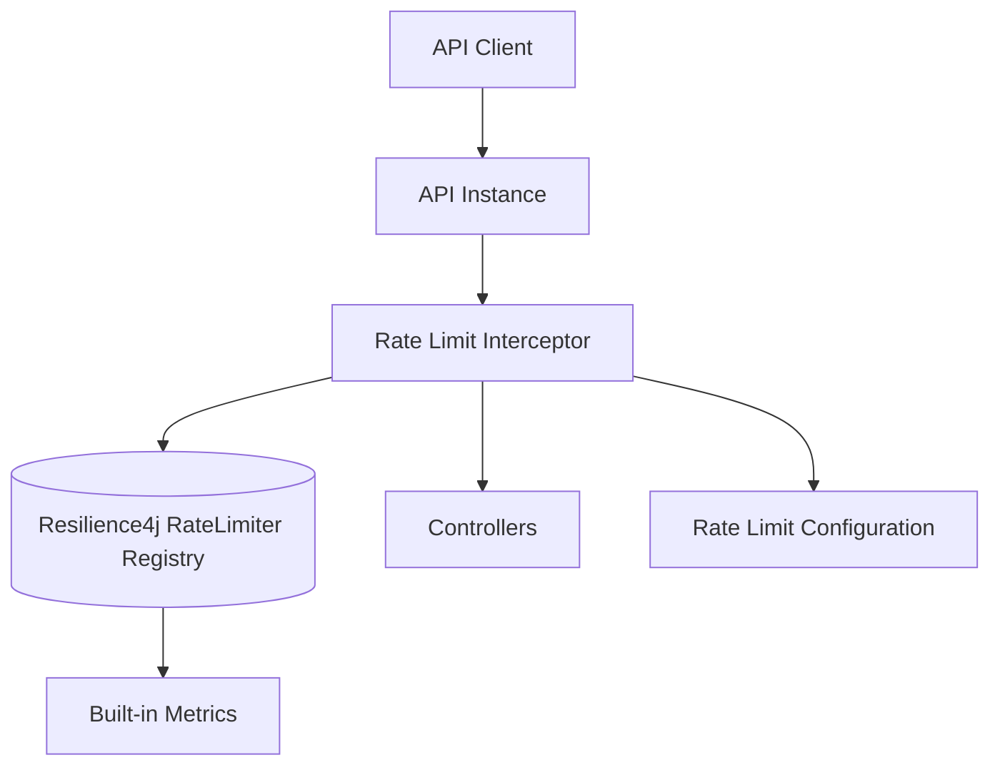
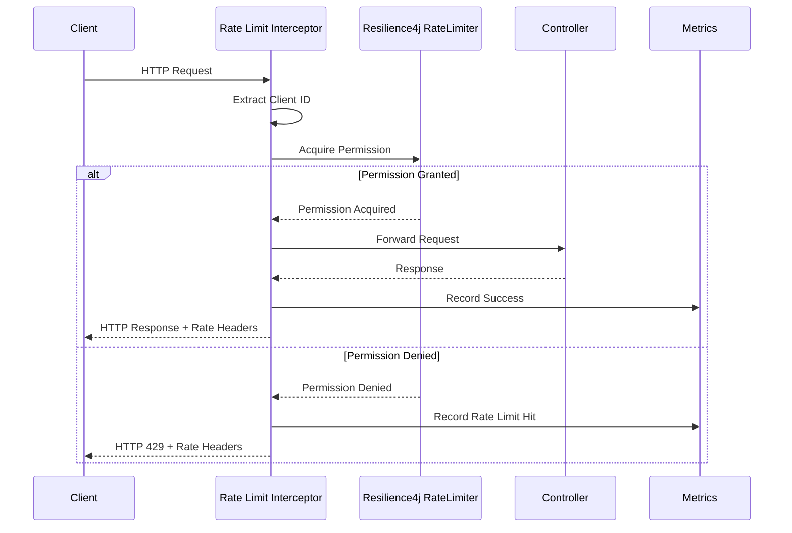
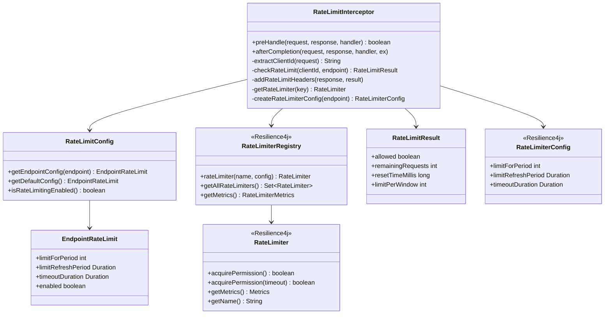
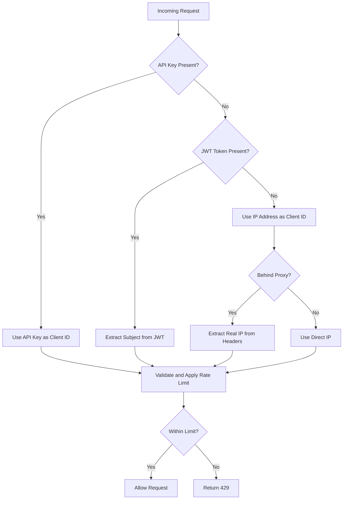
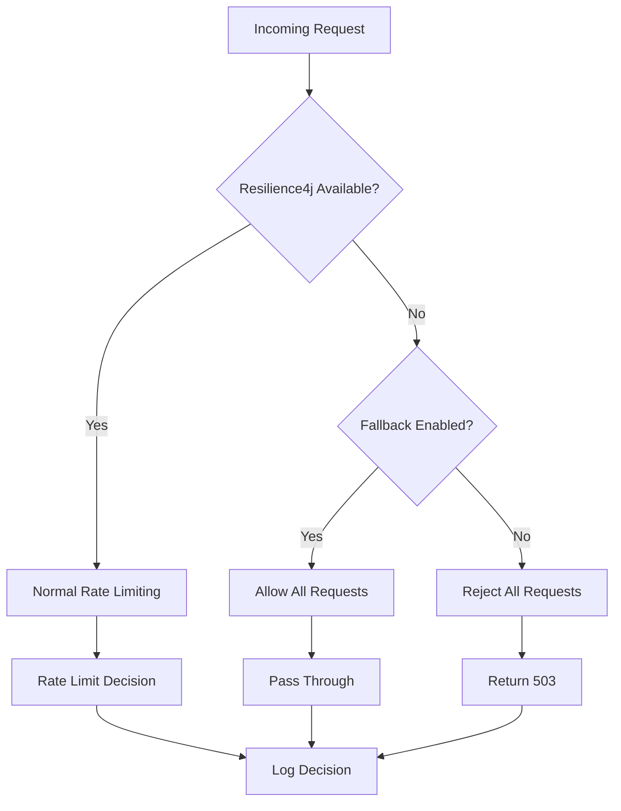

# API Rate Limiting Design Document

## Overview

The API Rate Limiting system will be implemented using Resilience4j's RateLimiter as a Spring Boot interceptor that evaluates incoming requests against configured rate limits before they reach the controller layer. Resilience4j provides a robust, thread-safe, and high-performance rate limiting solution with excellent Spring Boot integration and built-in monitoring capabilities.

This design leverages Resilience4j's proven sliding window algorithm and provides seamless integration with the existing Spring Security and configuration infrastructure. The solution requires no external dependencies and is ideal for single-instance deployments with excellent performance characteristics.

## Architecture

### System Architecture



**Key Benefits:**
- Purpose-built for rate limiting with proven algorithms
- Excellent Spring Boot integration and auto-configuration
- Built-in metrics and monitoring capabilities
- Thread-safe and high performance
- No external dependencies required
- Supports sliding window and fixed window algorithms

### Request Flow



## Components and Interfaces

### Core Components



### Client Identification Strategy



## Data Models

### Configuration Model

```yaml
# application.yml
app:
  rate-limiting:
    enabled: true
    client-identification:
      priority: ["api-key", "jwt-subject", "ip-address"]
      api-key-header: "X-API-Key"
      trusted-proxies: ["10.0.0.0/8", "172.16.0.0/12"]
    endpoints:
      "/api/accounts/**": "accounts-api"
      "/api/books/**": "books-api"
      "default": "default-api"

# Standard Resilience4j configuration
resilience4j:
  ratelimiter:
    configs:
      default:
        limitForPeriod: 10
        limitRefreshPeriod: PT1S
        timeoutDuration: PT0S
        registerHealthIndicator: true
        eventConsumerBufferSize: 100
        writableStackTraceEnabled: true
    instances:
      default-api:
        baseConfig: default
      accounts-api:
        baseConfig: default
        limitForPeriod: 5
        limitRefreshPeriod: PT1S
      books-api:
        baseConfig: default
        limitForPeriod: 20
        limitRefreshPeriod: PT1S
```

### Resilience4j Rate Limiter Mechanics

Resilience4j uses a **sliding window** algorithm that:
- Maintains a configurable number of permissions per time window
- Refreshes permissions at regular intervals
- Provides thread-safe access without external dependencies
- Supports both blocking and non-blocking permission acquisition

```java
// Rate limiter key structure: "clientId:endpoint"
// Examples:
// - "user123:/api/accounts"
// - "192.168.1.100:/api/books"
// - "api-key-abc:/api/accounts"
```

## Error Handling

### Rate Limit Response Format

```json
{
  "error": "rate_limit_exceeded",
  "message": "Rate limit exceeded for endpoint /api/accounts. Try again in 45 seconds.",
  "details": {
    "endpoint": "/api/accounts",
    "limit": 50,
    "window": "minute",
    "retry_after": 45
  }
}
```

### HTTP Headers

```
X-RateLimit-Limit: 50
X-RateLimit-Remaining: 0
X-RateLimit-Reset: 1642694400
X-RateLimit-Window: minute
Retry-After: 45
```

### Fallback Strategy



## Testing Strategy

### Unit Tests
- **RateLimitInterceptor**: Test request interception, rate limiting logic, and header setting
- **RateLimitConfig**: Test configuration parsing and validation
- **Client ID Extraction**: Test various client identification scenarios
- **Resilience4j Integration**: Test RateLimiter creation and permission acquisition

### Integration Tests
- **End-to-End Rate Limiting**: Test actual HTTP requests against rate limits
- **Configuration Loading**: Test different configuration scenarios
- **Error Handling**: Test Resilience4j failures and fallback behavior
- **Spring Integration**: Test interceptor registration and Spring context integration