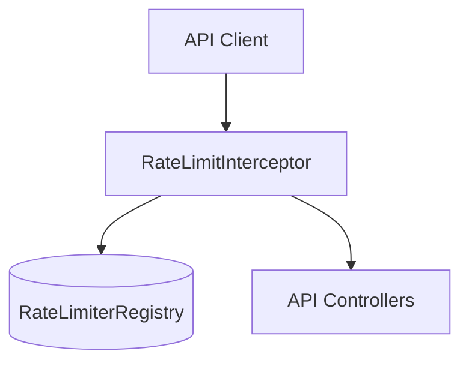
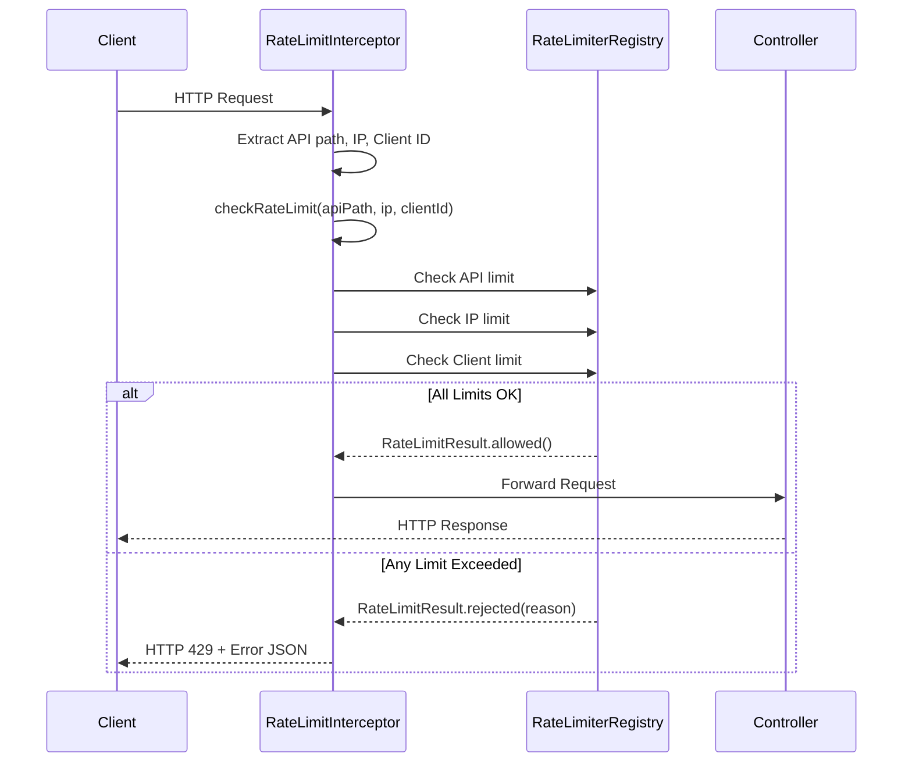
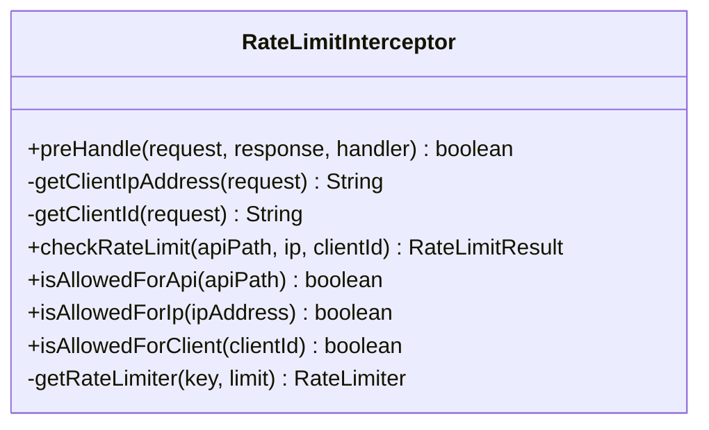
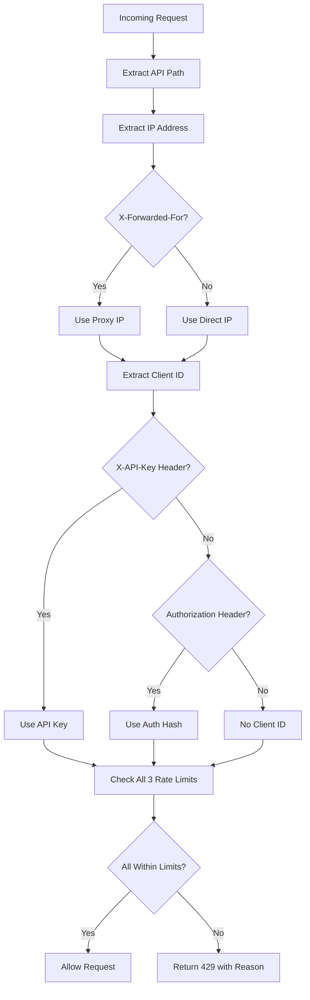
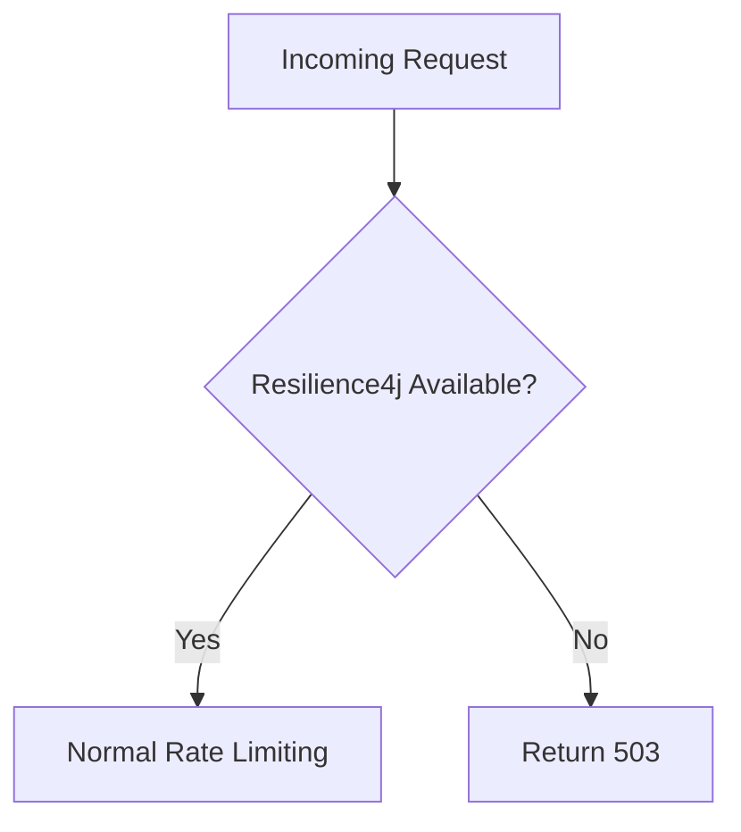

# API Rate Limiting Design Document

## Overview

The API Rate Limiting system is implemented as a simple, direct solution using Resilience4j's RateLimiter with a Spring Boot interceptor. The design focuses on three specific use cases:

1. **Per-API endpoint limits** - Total requests per minute for specific API endpoints
2. **Per-IP address limits** - Total requests per minute by client IP across all APIs  
3. **Per-client ID limits** - Total requests per minute by client identifier across all APIs

This simplified approach eliminates unnecessary complexity while providing robust rate limiting using Resilience4j's proven algorithms and excellent Spring Boot integration.

## Architecture

Resilience4j provides a robust, thread-safe, and high-performance rate limiting solution with excellent Spring Boot integration and built-in monitoring capabilities.

This design leverages Resilience4j's proven sliding window algorithm.  The solution requires no external dependencies and is ideal for single-instance deployments with excellent performance characteristics.

### System Architecture



**Key Benefits:**
- Simple and direct implementation
- Uses Resilience4j RateLimiterRegistry for thread-safe rate limiting
- Fixed 1-minute window for all rate limits
- Automatic client identification (API key, JWT, IP address)
- Built-in status endpoint for monitoring

### Request Flow



## Components and Interfaces

### Core Components



### Client Identification Strategy



## Data Models

### Rate Limiting Configuration

The system uses application.yml defaults that can be easily modified:

```yaml
# application.yml
app:
  rate-limiting:
    enabled: true
    
# Standard Resilience4j configuration
resilience4j:
  ratelimiter:
    configs:
      default:
        limitForPeriod: 10
        limitRefreshPeriod: 60s
        timeoutDuration: 5s
        registerHealthIndicator: true
        eventConsumerBufferSize: 100
        writableStackTraceEnabled: true
    instances:
      default-api:
        baseConfig: default
      accounts-api:
        baseConfig: default
        limitForPeriod: 5
        limitRefreshPeriod: PT1S
      books-api:
        baseConfig: default
        limitForPeriod: 20
        limitRefreshPeriod: PT1S
```

### Rate Limiter Key Structure

```java
// Rate limiter keys are simple strings:
"endpoint:/api/v1/books"           // API endpoint limit
"ip:192.168.1.100"         // IP address limit
"client:api-key-abc123"    // Client ID limit
```

### Client Identification

```java
// Client ID extraction priority:
1. X-API-Key header → "api-key:{value}"
2. Authorization header → "auth:{hashCode}"  
3. No client ID → null (only IP and API limits apply)

// IP address extraction:
1. X-Forwarded-For header (first IP)
2. X-Real-IP header
3. request.getRemoteAddr()
```

## Error Handling

### Rate Limit Response Format

```json
{
  "error": "rate_limit_exceeded",
  "message": "Rate limit exceeded for endpoint /api/accounts. Try again in 45 seconds.",
}
```

### HTTP Headers

```
X-RateLimit-Limit: 50
X-RateLimit-Window: minute
Retry-After: 45
```

### Fallback Strategy


